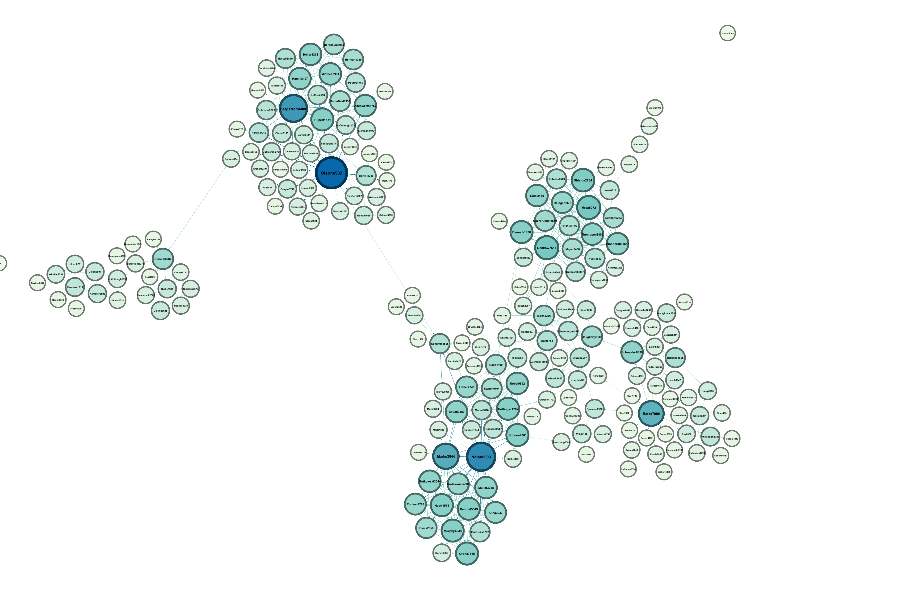

# discord-mutual-friends

jank script and program for generating a .dot file for visualisation of mutual friends in Discord




```console
$ chmod +x ./relationship.sh
$ TOKEN=<discord-token-here> ./relationship.sh > graph.json
$ go mod download 
$ go run main.go > graph.dot # open in tools like Gephi 
$ go run main.go | dot -Tsvg > graph.svg # open in browser / image viewer
```

